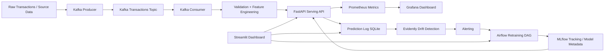

# Architecture

## Overview

This project implements a real-time fraud detection system with end-to-end MLOps components. It combines data ingestion, validation, feature preparation, model serving, monitoring, drift detection, alerting, retraining orchestration, and a user-facing demo dashboard into a single workflow. The architecture is designed to demonstrate the full machine learning lifecycle in a practical, production-inspired setup.

## High-Level Design

At a high level, the system processes transactions through a streaming and serving pipeline, records prediction behavior, monitors the system with metrics and dashboards, and supports retraining through orchestration. The design emphasizes reproducibility, observability, and modularity.

## Architecture Diagram

## Component Breakdown

### 1. Transaction Source and Ingestion

The system begins with a transaction source, which may be a dataset-backed producer or a simulated real-time transaction stream. A Kafka producer publishes transaction messages into a Kafka topic. This models the ingestion layer of a real-time ML system and decouples event production from downstream processing.

### 2. Kafka Consumer

A Kafka consumer subscribes to transaction events and performs initial processing. Its responsibilities include:

- consuming transaction messages
- validating message structure
- handling malformed or invalid records
- forwarding failed records to a dead-letter queue
- preparing transactions for downstream feature and serving logic

The consumer also includes production-minded hardening such as manual offset commits, structured logging, graceful shutdown handling, and dead-letter support.

### 3. Validation and Feature Engineering

Validation logic helps ensure that incoming records satisfy the required schema and basic constraints. Feature engineering transforms raw fields into model-ready structure or prepares features in a consistent serving format. This helps reduce training-serving skew and supports more reliable prediction behavior.

### 4. FastAPI Inference Service

The FastAPI application is the online serving layer. It provides:

- `GET /health` for service health and runtime metadata
- `GET /model-info` for model metadata
- `POST /predict` for transaction scoring
- `GET /metrics` for Prometheus scraping

The API validates request payloads with Pydantic schemas, returns structured prediction responses, logs predictions to persistent storage, and exposes metrics for observability.

### 5. Prediction Logging

Every prediction is written to a SQLite predictions store. Logged fields include:

- timestamp
- transaction id
- input hash
- raw payload JSON
- fraud probability
- fraud classification
- model version
- latency

This prediction log supports:

- recent prediction inspection
- Streamlit live table display
- drift detection comparisons
- future performance analysis workflows

### 6. MLflow

MLflow is used for experiment tracking and model-related metadata workflows. It supports experiment logging, model comparison, and model registry style workflows. In a fuller production setup, the serving layer would load a registered production model directly from MLflow model artifacts or registry metadata.

### 7. Monitoring with Prometheus and Grafana

Prometheus scrapes the API metrics endpoint and collects time-series monitoring data. Grafana visualizes the collected metrics through dashboards.

Typical monitored metrics include:

- prediction request count
- prediction latency histogram
- model version state
- drift score
- service health

This gives visibility into both infrastructure behavior and model-serving behavior.

### 8. Drift Detection with Evidently

Drift detection compares recent prediction inputs against a reference dataset. The system uses Evidently to:

- generate drift reports as HTML artifacts
- compute a numeric drift score
- support threshold-based alerting decisions

The drift report is also surfaced in the Streamlit dashboard, connecting monitoring artifacts to a user-facing interface.

### 9. Alerting

An alerting module evaluates drift results against configured thresholds. When the threshold is exceeded, it can trigger a retraining workflow through the Airflow API. This demonstrates how monitoring signals can be translated into MLOps automation.

### 10. Airflow Retraining Pipeline

Airflow orchestrates retraining steps. The retraining DAG is responsible for operations such as:

- validating new data
- engineering features
- training a candidate model
- evaluating performance
- deciding whether to promote or reject the updated model
- logging or notifying outcomes

This provides the orchestration layer for continuous training and governance.

### 11. Streamlit Dashboard

The Streamlit app acts as a lightweight demo frontend. It provides sections for:

- submitting transactions for prediction
- viewing recent predictions
- inspecting API health and model info
- locating drift reports
- showing pipeline and model summaries

This helps demonstrate user-facing application development alongside the MLOps backend.

## Data Flow

### Online Path

1. A transaction is generated or ingested.
2. Kafka producer publishes it.
3. Kafka consumer validates and processes it.
4. FastAPI serves a prediction.
5. Prediction is logged to SQLite.
6. Metrics are exposed to Prometheus.
7. Grafana visualizes the metrics.

### Monitoring Path

1. Prediction logs are collected.
2. Recent payloads are compared against a reference dataset.
3. Evidently generates a drift report.
4. Drift score is evaluated.
5. Alerting decides whether retraining should be triggered.

### Retraining Path

1. Airflow retraining DAG is triggered.
2. Validation, feature engineering, and model update steps run.
3. Results are tracked through model workflow metadata.
4. Serving can be updated based on promotion logic.

## Design Decisions

### Modular Services

The project uses separate services for ingestion, serving, monitoring, orchestration, and demo visualization. This makes the system easier to reason about and closer to real MLOps deployments.

### Containerization

Docker Compose is used to coordinate multiple services locally, including Kafka, Redis, MLflow, Airflow, Prometheus, Grafana, and Streamlit. This makes the development environment reproducible and easier to demo.

### Prediction Persistence

SQLite is used as a lightweight persistence layer for predictions. This is simple for local development and enough to support drift detection and dashboard display without requiring a heavier database.

### Observability-First Design

The architecture prioritizes visibility through logs, metrics, dashboards, and reports. This is important because production ML systems must be monitored not only for infrastructure health but also for model behavior and data changes.

### Incremental Production Realism

Some parts of the system are intentionally simplified for local development and demonstration, but the structure mirrors how a fuller production system would be organized.

## Failure Handling and Reliability Features

The project includes several hardening ideas:

- consumer group configuration
- manual Kafka offset commits
- dead-letter queue handling
- graceful shutdown
- strict request validation in the API
- environment-based settings
- metrics exposure for monitoring

These features help bridge the gap between a notebook-based ML project and an operational ML service.

## Monitoring and Alerting Summary

The observability design includes:

- Prometheus for scraping metrics
- Grafana for dashboarding
- Evidently for drift reports
- alerting logic for threshold checks
- Airflow API integration for retraining trigger attempts

This gives the project a closed-loop monitoring story that is especially useful for portfolio presentation.

## Security and Configuration Approach

Configuration is centralized through environment-based settings and YAML config files. Sensitive values such as service credentials and environment-specific settings are intended to be injected through `.env` or container environment variables rather than hardcoded into business logic. This improves portability and keeps deployment-specific details separate from application code.

## Testing Strategy

The project uses multiple layers of validation:

- unit tests for feature engineering and API logic
- monitoring tests for metrics and drift reporting
- integration-style checks across serving and monitoring components
- lifecycle verification across the broader MLOps stack
- load testing to evaluate throughput, latency, and reliability under traffic

This supports both correctness and operational confidence.

## Future Architecture Improvements

Potential next improvements include:

- full MLflow model loading inside the serving container
- stronger feature-store integration for online and offline consistency
- persistent backing stores beyond SQLite
- asynchronous inference pipeline improvements
- notification delivery for alerts
- Kubernetes deployment
- automated CD pipeline for serving rollout
- live performance monitoring with delayed ground-truth labels

## Summary

This architecture demonstrates a practical MLOps system for fraud detection with clear separation of concerns across ingestion, serving, monitoring, alerting, retraining, and user interaction. It is intentionally designed to show both machine learning workflow understanding and application/system integration skills in one project.
